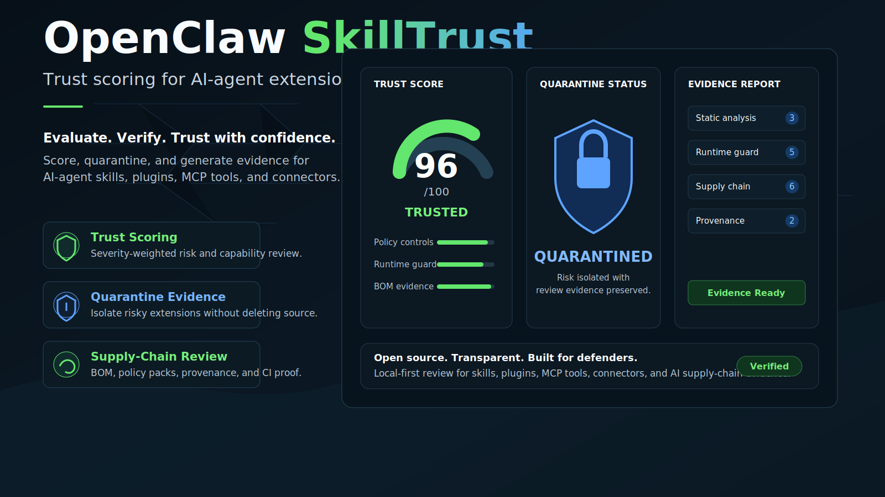
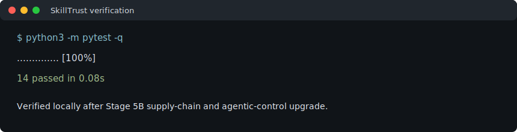
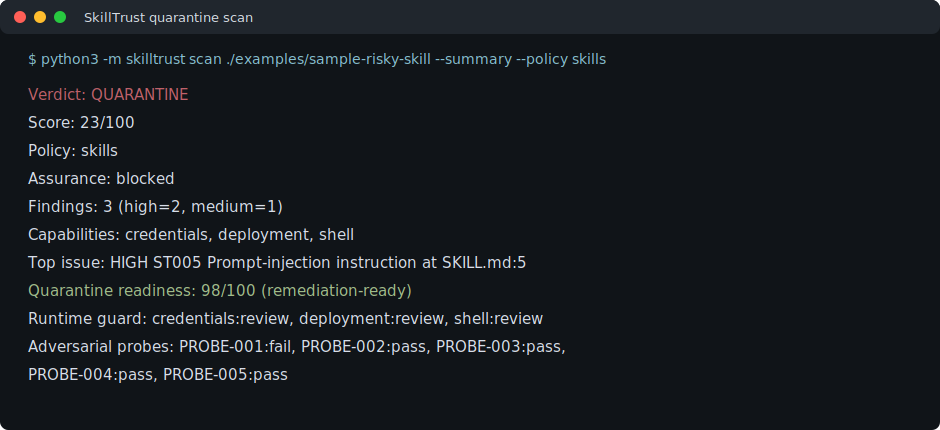
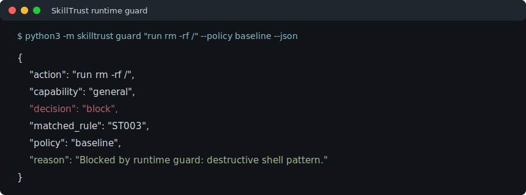

# OpenClaw SkillTrust



**Trust scoring for the agent toolchain.**

OpenClaw SkillTrust is an open-source, defensive audit layer for AI-agent
skills, MCP tools, plugins, connectors, and local automation packages. It helps
maintainers and platform teams answer a practical question before installing or
running agent extensions:

**What can this extension do, what evidence supports that claim, and should it
be trusted, reviewed, quarantined, or blocked?**

SkillTrust scans extension manifests and source text, classifies capabilities,
detects risky instructions, flags secret exposure and private-path leakage,
builds a trust score, applies policy-pack control checks, and produces portable
JSON or Markdown evidence reports.

Stage 4 adds runtime-governance previews, controlled adversarial probe results,
and compliance-oriented evidence mapping so reviewers can see how sensitive
agent actions should be handled before execution.

Stage 5B adds supply-chain and agentic-security hardening: OpenSSF-style
repository checks, SLSA/provenance readiness, CycloneDX-style BOM export, and
expanded OWASP Agentic AI control mapping.

It is built for open-source projects that want agent ecosystems to grow without
turning every plugin install into a blind trust decision.

## Why It Exists

AI agents increasingly depend on skills, tool servers, connectors, and plugin
manifests. Those extensions can request access to files, shell commands,
network calls, memory, browsers, messaging systems, payments, deployments, or
external services.

Open-source maintainers need a local-first way to review that trust boundary:

- Which capabilities does the extension appear to use?
- Does the manifest match the behavior visible in files?
- Are there prompt-injection or instruction-hijacking patterns?
- Are there private machine paths, token names, or secret-like values?
- Should this extension be accepted, manually reviewed, quarantined, or blocked?

SkillTrust turns that review into repeatable evidence.

## Verified Results







## GitHub Release Gate

This repository is prepared for GitHub publication as a defensive pre-release.
Before making it public, verify:

- `.pytest_cache/`, `__pycache__/`, local logs, and temporary artifacts are not
  committed.
- GitHub Actions completes the test and evidence workflow.
- The uploaded `skilltrust-evidence` artifact contains safe and quarantine
  evidence bundles plus `skilltrust-bom.json`.
- Provenance attestation is expected only after the repository is public;
  private review runs still generate and upload evidence artifacts.
- The quarantine readiness score remains visible and separate from raw trust
  score.
- No real credentials, private machine paths, internal infrastructure details,
  or buyer-irrelevant workspace references are present.
- Generated screenshots under `docs/assets/` render near the top of this
  README.

## What It Does

- Discovers common AI-extension files such as `SKILL.md`, `plugin.json`,
  `package.json`, `pyproject.toml`, README files, scripts, and configs.
- Classifies capability exposure across shell, filesystem, network, browser,
  memory, messaging, scheduling, payments, deployment, and credential access.
- Detects risky instructions such as command execution, curl-pipe-shell flows,
  destructive filesystem operations, prompt-injection language, private local
  paths, and secret-like material.
- Scores trust from 0 to 100 with clear severity-weighted findings.
- Adds enterprise evidence fields: policy pack, assurance level, severity
  breakdown, control checks, and explainable score factors.
- Adds Stage 4 runtime guard previews for allow, review, and block decisions.
- Runs controlled adversarial probes for prompt-injection, exfiltration,
  unsafe-install, destructive-action, and instruction-boundary evidence.
- Maps review evidence to SOC 2, ISO/IEC 42001, OWASP LLM/Agentic, and EU AI
  Act readiness control language.
- Adds a separate quarantine readiness score so risky packages can show a
  verified remediation path toward `98/100` without inflating the raw trust
  score.
- Adds supply-chain controls for security policy, tests, evidence workflows,
  least-privilege workflow permissions, provenance readiness, pinned action
  references, and BOM export.
- Returns one of four verdicts: `trusted`, `review`, `quarantine`, or `block`.
- Produces machine-readable JSON and maintainer-friendly Markdown reports.
- Produces evidence bundles with JSON, Markdown, printable HTML, executive
  summary, risk register, and remediation checklist artifacts.
- Can quarantine evidence locally without deleting source files.
- Ships with GitHub Actions proof workflow for test and evidence artifact
  generation.
- Ships with tests and safe mock examples.

## Community Principles

- Defensive by default.
- Local-first before hosted.
- Evidence over reputation.
- Reviewable rules over opaque scoring.
- No exploit workflows, credential harvesting, stealth, persistence, evasion, or
  unauthorized access.

## Quick Start

Install locally:

```bash
python3 -m pip install .
```

Install test tooling for contributor verification:

```bash
python3 -m pip install ".[test]"
```

Scan a skill or plugin folder:

```bash
python3 -m skilltrust scan ./examples/sample-safe-skill
```

Write a Markdown report:

```bash
python3 -m skilltrust scan ./examples/sample-safe-skill --markdown ./skilltrust-report.md
```

Print a compact review summary:

```bash
python3 -m skilltrust scan ./examples/sample-risky-skill --summary
```

Apply a stricter policy pack:

```bash
python3 -m skilltrust scan ./examples/sample-risky-skill --summary --policy skills
```

Fail CI when an extension needs quarantine or blocking:

```bash
python3 -m skilltrust scan ./examples/sample-safe-skill --fail-on quarantine
```

Create a quarantine evidence bundle for manual review:

```bash
python3 -m skilltrust quarantine ./examples/sample-risky-skill --output ./review-bundle
```

Create an executive evidence bundle:

```bash
python3 -m skilltrust evidence ./examples/sample-risky-skill --policy skills --output ./evidence-bundle
```

Write a CycloneDX-style tool and capability inventory:

```bash
python3 -m skilltrust bom ./examples/sample-risky-skill --policy skills --output ./skilltrust-bom.json
```

Preview a proposed runtime action:

```bash
python3 -m skilltrust guard "deploy to production" --policy baseline
```

Destructive or credential-exfiltration patterns are blocked by the guard. Gated
capabilities such as shell, payment, deployment, and credential access require
human review.

## Verdicts

- `trusted`: no blocking risk detected; normal maintainer review still applies.
- `review`: risk is visible but likely manageable with human review.
- `quarantine`: risky behavior or mismatch should be isolated before use.
- `block`: high-risk indicators should prevent installation or execution.

## Quarantine Readiness

The trust score and quarantine readiness score measure different things:

- Trust score: how safe the extension appears before remediation.
- Quarantine readiness: how complete the evidence package is for review,
  remediation, governance mapping, and controlled release decisions.

A quarantined extension can reach `98/100` readiness when detector evidence,
remediation actions, policy controls, runtime guard decisions, adversarial
probes, governance mappings, supply-chain checks, provenance readiness, and BOM
evidence are present. The raw trust score remains low until the risky source
evidence is actually fixed, keeping the verdict honest while showing that the
quarantine workflow itself is commercially mature.

## Evidence Bundles

The `evidence` command writes buyer- and maintainer-friendly artifacts:

- `skilltrust-report.json`: machine-readable scan evidence.
- `skilltrust-report.md`: maintainer review report.
- `skilltrust-report.html`: printable executive report that can be saved as
  PDF from a browser.
- `executive-summary.md`: decision summary for repository or buyer review.
- `risk-register.csv`: finding register for spreadsheet workflows.
- `remediation-checklist.md`: release gate and remediation checklist.
- `skilltrust-bom.json`: CycloneDX-style capability and finding inventory.
- `supply-chain-review.md`: OpenSSF/SLSA/BOM readiness review.

The included GitHub Actions workflow runs tests, generates safe and quarantine
evidence bundles, creates BOM output, attests generated artifacts, and uploads
them as workflow artifacts.

## Policy Packs

Policy packs turn raw detector output into review controls for different
operating contexts:

- `baseline`: default defensive review for installable agent extensions.
- `mcp-tools`: review profile for MCP tool servers and connector-style tools.
- `skills`: review profile for reusable agent skills and procedures.
- `plugins`: review profile for plugins with executable code or manifests.
- `repo-hygiene`: strict profile for public repository readiness checks.

Reports include control checks such as blocking rule enforcement, gated
capability review, declared review boundary, and evidence availability. This
keeps the tool useful for internal governance without requiring a hosted
service or external scan.

List available packs:

```bash
python3 -m skilltrust policies
```

## Modules

- `discovery.py` finds candidate extension files while avoiding heavy folders.
- `manifest.py` parses JSON and text manifests into normalized metadata.
- `capabilities.py` maps text and manifest clues to capability classes.
- `detectors.py` applies defensive risk rules to extension files.
- `scanner.py` coordinates discovery, manifest parsing, detection, and scoring.
- `trust_score.py` produces score, verdict, and prioritized remediation.
- `report_renderer.py` renders public Markdown reports.
- `bom.py` writes CycloneDX-style capability and finding inventories.
- `evidence.py` writes executive report bundles for review artifacts.
- `quarantine.py` writes review bundles without modifying source files.
- `policies.py` defines default policy packs for common extension types.
- `runtime_guard.py` previews allow, review, or block decisions for actions.
- `probes.py` adds controlled adversarial probe evidence.
- `compliance.py` maps findings to governance review frameworks.
- `readiness.py` scores quarantine remediation evidence completeness.
- `cli.py` exposes the command interface.
- `supply_chain.py` checks repository security, provenance, and BOM readiness.
- `ENTERPRISE_READINESS.md` defines internal Stage 4 review gates before any
  launch decision.

## Layout Blueprint

```text
skilltrust/
  capabilities.py     # capability classifier
  cli.py              # python3 -m skilltrust entrypoint
  compliance.py       # governance framework mappings
  detectors.py        # defensive risk rules
  discovery.py        # candidate file discovery
  manifest.py         # extension manifest parser
  models.py           # report and finding data models
  probes.py           # controlled adversarial probes
  quarantine.py       # local review bundle writer
  report_renderer.py  # Markdown report renderer
  bom.py              # CycloneDX-style inventory writer
  evidence.py         # executive evidence bundle writer
  supply_chain.py     # supply-chain evidence controls
  runtime_guard.py    # runtime policy decision preview
  scanner.py          # unified scan flow
  trust_score.py      # trust scoring and verdicts
tests/
  test_skilltrust.py  # standard-library unit coverage
```

## Project Status

SkillTrust is pre-release open-source software. It is designed for defensive
review, ecosystem trust, and governance evidence. It does not perform
exploitation, credential harvesting, stealth, persistence, evasion, or
unauthorized access.

## Get Involved

Good first contribution areas:

- Additional safe fixtures
- More manifest formats
- GitHub Actions examples
- Better Markdown reporting
- SBOM and lockfile capability hints

Advanced contribution areas:

- Signed trust reports
- MCP server manifest adapters
- Cross-repository trust baselines
- Policy packs for organizations
- Integration with OpenClaw GuardTower
